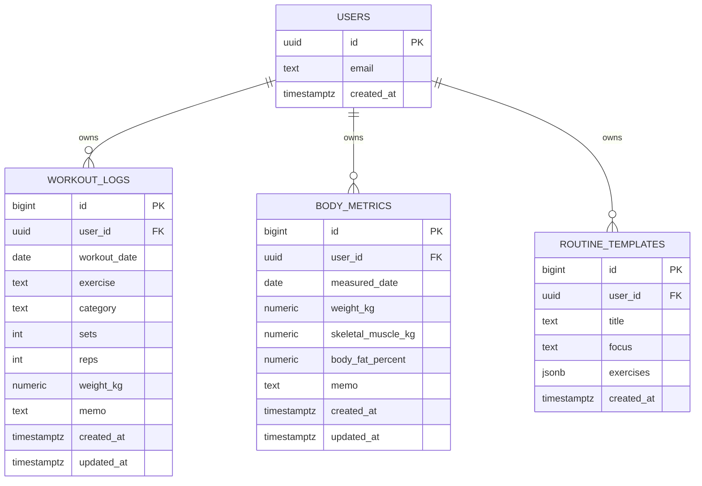

# Data Model And DB Plan

## Recommended Production DB

Supabase PostgreSQL을 권장한다.

### Why

- PostgreSQL 기반이라 운동/인바디/루틴 데이터를 관계형으로 안정적으로 관리할 수 있다.
- Supabase Auth와 Row Level Security로 사용자별 데이터 접근 제어가 쉽다.
- REST API와 Kotlin 클라이언트로 Android 앱에서 접근 가능하다.
- 무료 플랜으로 MVP를 시작하기 쉽고, 운영 시 백업과 마이그레이션 관리가 가능하다.

## Build Plan

1. Supabase 프로젝트 생성
2. `profiles`, `workout_logs`, `body_metrics`, `routine_templates` 테이블 생성
3. Supabase Auth 활성화
4. 모든 테이블에 `user_id` 추가
5. Row Level Security 정책 적용: `auth.uid() = user_id`
6. Android 앱은 로컬 SQLite/Room에 먼저 저장
7. 네트워크가 가능하면 Supabase와 변경분 동기화

## Current Implementation DB

현재 앱은 외부 API 키 없이 실행되도록 Android 기본 SQLite를 사용한다.

- DB file: `/data/data/com.example.pressandpull/databases/press_and_pull.db`
- Tables: `users`, `workout_logs`, `body_metrics`
- Demo account: `demo` / `1234`
- User fields: `username`, `name`, `email`, `birthDate`, `passwordHash`
- 운동 기록과 인바디 기록은 `userId`로 사용자별 분리 저장된다.

## ERD

