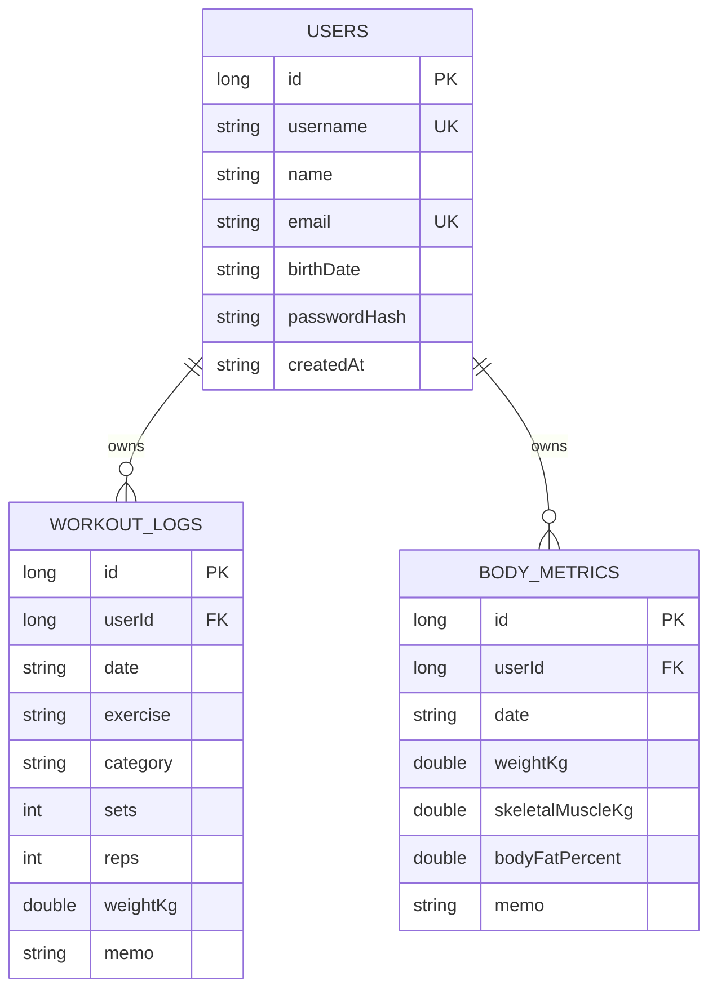

# Data Model And ERD

## Storage

현재 구현은 Room 로컬 데이터베이스를 사용한다. 데이터베이스 파일은 Android 앱 내부 저장소에 생성되며, 네트워크가 없어도 로그인 데모 계정, 운동 기록, 인바디 기록의 핵심 기능이 동작한다.

- Database: `FitnessDatabase`
- DAO: `FitnessDao`
- Repository: `FitnessRepository`
- DB file: `press_and_pull.db`

## Tables

### users

사용자 계정 정보를 저장한다. 비밀번호는 평문이 아니라 SHA-256 해시값으로 저장한다.

| Column | Type | Description |
| --- | --- | --- |
| id | Long | Primary Key, auto generated |
| username | String | 로그인 아이디, unique |
| name | String | 사용자 이름 |
| email | String | 이메일, unique |
| birthDate | String | 생년월일 |
| passwordHash | String | SHA-256 비밀번호 해시 |
| createdAt | String | 계정 생성일 |

### workout_logs

운동 기록을 저장한다. `userId`로 사용자별 데이터를 분리한다.

| Column | Type | Description |
| --- | --- | --- |
| id | Long | Primary Key, auto generated |
| userId | Long | users.id Foreign Key |
| date | String | 운동 날짜 |
| exercise | String | 운동명 |
| category | String | 운동 부위 |
| sets | Int | 세트 수 |
| reps | Int | 반복 횟수 |
| weightKg | Double | 중량 |
| memo | String | 메모 |

### body_metrics

인바디/신체 지표 기록을 저장한다. `userId`로 사용자별 데이터를 분리한다.

| Column | Type | Description |
| --- | --- | --- |
| id | Long | Primary Key, auto generated |
| userId | Long | users.id Foreign Key |
| date | String | 측정 날짜 |
| weightKg | Double | 체중 |
| skeletalMuscleKg | Double | 골격근량 |
| bodyFatPercent | Double | 체지방률 |
| memo | String | 메모 |

## Relationships

- `users` 1:N `workout_logs`
- `users` 1:N `body_metrics`
- 사용자 삭제 시 관련 운동/인바디 기록은 Room ForeignKey Cascade 정책으로 삭제된다.

## ERD

